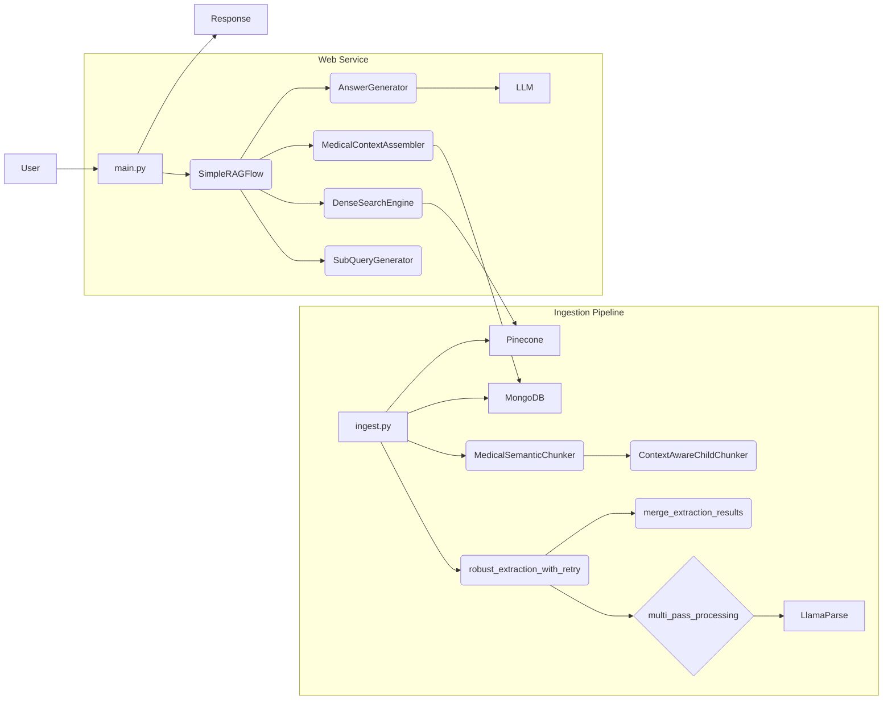
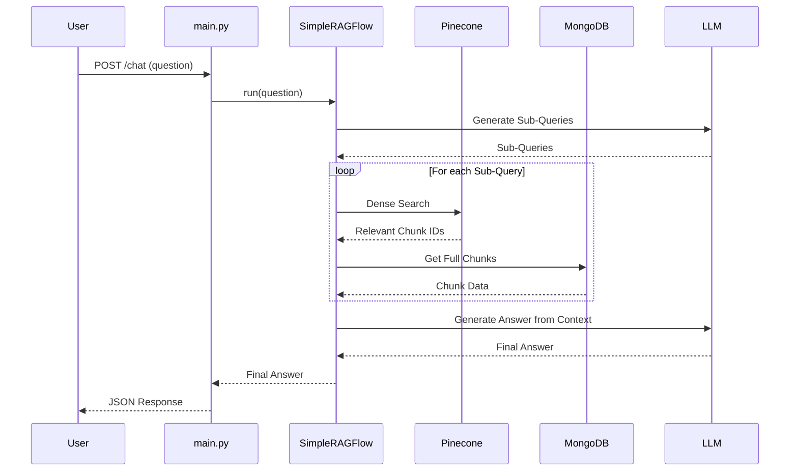

# Medical RAG Chatbot: Comprehensive Analysis

## 1) Top-level summary (1 paragraph)

This project is a Medical RAG (Retrieval-Augmented Generation) Chatbot designed to answer queries based on a corpus of medical PDF documents. It functions as a web service using Python and the FastAPI framework for its backend. The architecture consists of two main parts: a data ingestion pipeline that processes PDFs using `LlamaParse`, stores text and metadata in MongoDB, and manages vector embeddings in Pinecone; and a query processing pipeline that uses a Large Language Model (LLM) to generate answers from the retrieved context, handling complex queries by breaking them into sub-queries.

## 2) Execution / Graph Flow Overview

### Entry Points

*   **Data Ingestion:** `rag_chatbot/scripts/ingest.py`
*   **Web Service:** `rag_chatbot/app/main.py`

### Step-by-step Execution Sequence

**A. Data Ingestion (running `ingest.py`)**

1.  The `main` function in `ingest.py` is executed.
2.  It connects to MongoDB and Pinecone using credentials from `.env` variables.
3.  It creates two Pinecone indexes (`parent_chunks_medical` and `child_chunks_medical`) if they don't exist.
4.  It scans the `rag_chatbot/data/` directory for PDF files.
5.  The `robust_extraction_with_retry` function is called, which in turn calls `multi_pass_processing`.
6.  `multi_pass_processing` uses `LlamaParse` to perform two separate parsing passes on each PDF: one for standard text and one optimized for tables.
7.  The results from both passes are merged by `merge_extraction_results` to create a unified set of document nodes.
8.  Back in `main`, the script iterates through the parsed nodes, grouped by the source document.
9.  For each document, the text is cleaned (`clean_formatting_artifacts`, `enhance_table_structure`).
10. `MedicalSemanticChunker.create_parent_chunks` splits the text into large, semantically meaningful parent chunks and enriches them with metadata (e.g., section titles, medical entities).
11. For each parent chunk, `ContextAwareChildChunker.create_child_chunks` creates smaller child chunks, preserving context.
12. All generated parent and child chunks (as `DocumentChunk` Pydantic models) are stored in a MongoDB collection after clearing existing data.
13. The script then clears the Pinecone indexes.
14. Vector embeddings are generated for all parent and child chunks using the `get_embedding_model`, and they are upserted into their respective Pinecone indexes in batches.
15. Finally, `track_extraction_metrics` logs a summary of the ingestion process.

**B. Web Service (running `main.py`)**

1.  The FastAPI application is initialized. An instance of `SimpleRAGFlow` is created.
2.  When a POST request is made to the `/chat` endpoint with a user's question:
3.  The `chat_endpoint` function is called.
4.  It retrieves the conversation history from the in-memory `chat_history_store`.
5.  It calls the `agent.run()` method (from `SimpleRAGFlow`).
6.  Inside `SimpleRAGFlow`, the query is processed through a series of steps (detailed in `simple_flow.py` analysis), which involves generating sub-queries, performing dense searches on Pinecone, reranking results, assembling context from MongoDB, and generating a final answer with an LLM.
7.  The final answer is returned to `chat_endpoint`.
8.  The user's question and the AI's answer are appended to the `chat_history_store`.
9.  The final answer is sent back to the client as a JSON response.

### Call Graph (Mermaid)



### Sequence Diagram (Mermaid)



### Property Graph Model (Neo4j)

**Nodes:**

*   `(:Document {doc_id: UUID, pdf_name: string})`
*   `(:Chunk {chunk_id: UUID, chunk_type: string, text: string, contains_phi: boolean})`
*   `(:MedicalEntity {name: string, type: string})`
*   `(:Section {title: string})`
*   `(:Table {type: string})`
*   `(:UserQuery {text: string, timestamp: datetime})`
*   `(:Answer {text: string})`

**Relationships:**

*   `(:Document)-[:HAS_CHUNK]->(:Chunk)`
*   `(:Chunk)-[:CHILD_OF]->(:Chunk)`
*   `(:Chunk)-[:MENTIONS]->(:MedicalEntity)`
*   `(:Chunk)-[:PART_OF_SECTION]->(:Section)`
*   `(:Chunk)-[:CONTAINS_TABLE]->(:Table)`
*   `(:UserQuery)-[:GENERATED]->(:Answer)`
*   `(:Answer)-[:BASED_ON]->(:Chunk)`

**Example Cypher Queries:**

```cypher
// Find all chunks from a specific document that mention "radiology"
MATCH (d:Document {pdf_name: "report.pdf"})-[:HAS_CHUNK]->(c:Chunk)-[:MENTIONS]->(e:MedicalEntity {name: "radiology"})
RETURN c.text, c.chunk_id;

// Retrieve child chunks for a given parent chunk
MATCH (parent:Chunk {chunk_id: "parent-uuid-123"})<-[:CHILD_OF]-(child:Chunk)
RETURN child.text, child.chunk_id
ORDER BY child.metadata.order_idx;

// Show the query-to-answer flow for a specific user query
MATCH (q:UserQuery {text: "What are the findings?"})-[:GENERATED]->(a:Answer)-[:BASED_ON]->(c:Chunk)
RETURN q.text AS Query, a.text AS Answer, collect(c.text) AS ContextChunks;
